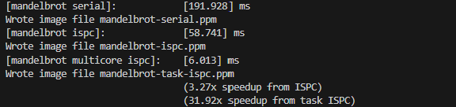
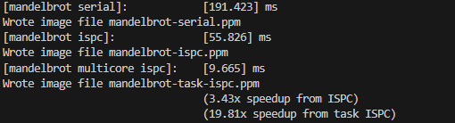

This is the best result, average result is like the second image. 

results are from executing which are different in every try due to machine performance flutters
```shell
./mandelbrot_ispc -t
```



This task is mainly used to understand the usage of simd and multicore
1. launch distributes work across multiple CPU cores.
2. foreach maps iterations to SIMD lanes within a single core (CPU thread)
3. eventhough the number of physical core is 16, but if I launch more than 16 cores, the performance could enhance more to 32 times at most.
## Why not have just foreach handle everything? -GPT4o generated
In theory, it might sound ideal if foreach handled both.

But in practice: foreach is not designed to distribute iterations across cores. It works within a core's SIMD lanes.

Auto-splitting iterations across threads requires runtime scheduling, load balancing, and task creation overhead, which launch handles explicitly and efficiently.

By separating the two, ISPC lets the programmer control task granularity, which helps performance tuning and better resource utilization.

## what happens when you launch 10,000 ISPC tasks? What happens when you launch 10,000 threads? -GPT4o generated
ISPC tasks are typically more efficient than launching a large number of threads because they focus on distributing tasks across multiple cores and minimizing overhead. The task scheduler in ISPC is optimized for this type of parallelism, and tasks can be small or large depending on the work you want to perform. It also avoids the overhead of managing thread contexts and large numbers of threads.

Threads can be more expensive in terms of context switching, memory usage, and scheduling overhead when the number of threads significantly exceeds the number of available cores. Threads are generally better for more coarse-grained parallelism where you have explicit control over each thread’s execution.

When you launch 10,000 ISPC tasks, it’s likely that the ISPC runtime will manage them efficiently across the available CPU cores, but the efficiency of this approach still depends on the nature of the tasks (i.e., how expensive they are). On the other hand, when launching 10,000 threads, you're more likely to face performance degradation due to overhead from the operating system trying to schedule and switch between those threads, especially if they are lightweight.