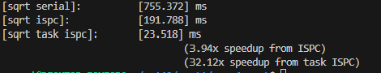
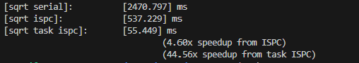
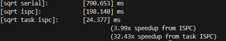
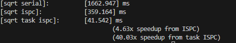
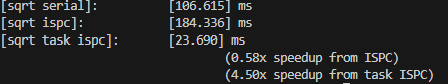
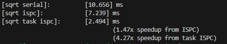

### values[i] = 2.99f;

### values[i] = 2.999999f;

### values[i] = 0.00001f;

### values[i] = 0.000000001f;

### values[i] = i % 8 ? 1.0f : 2.99f;
This way can decrease the simd speedup

###  values[i] = 1.0f
This way can decrease the speed up from multicore

1. The imbalance within a simd instruction can influence the speedup of ispc without task
2. the input value is closer to 1 the smaller overall speedup we have. This also apply to the boundary value(0, 3), namely if it is closer to the boundary value, the speedup could be bigger. 
3. 