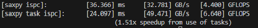
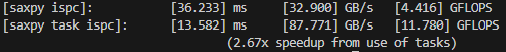
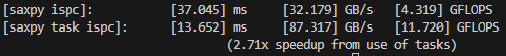
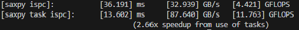
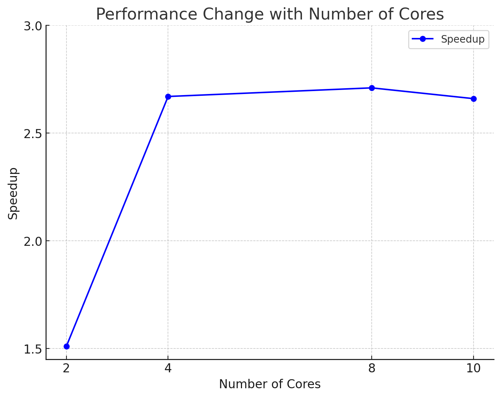

## 2

## 4

## 8

## 10

GPT4o generated, why the performance shows as above
1. Amdahl's Law: The speedup is limited by the serial portion of the program. Even with more cores, the serial parts still take time, capping the overall speedup.

2. Task Overhead: As more cores are added, the overhead from task distribution, synchronization, and communication increases, reducing the efficiency gains from additional cores.

3. Memory Bandwidth and Cache Limitations: Increased core count leads to higher memory access demands, and limited memory bandwidth can become a bottleneck, slowing down performance. Cache efficiency also declines with more cores.

4. Parallelism Saturation: Once the parallelizable part of the program is fully utilized, adding more cores yields diminishing returns in performance.